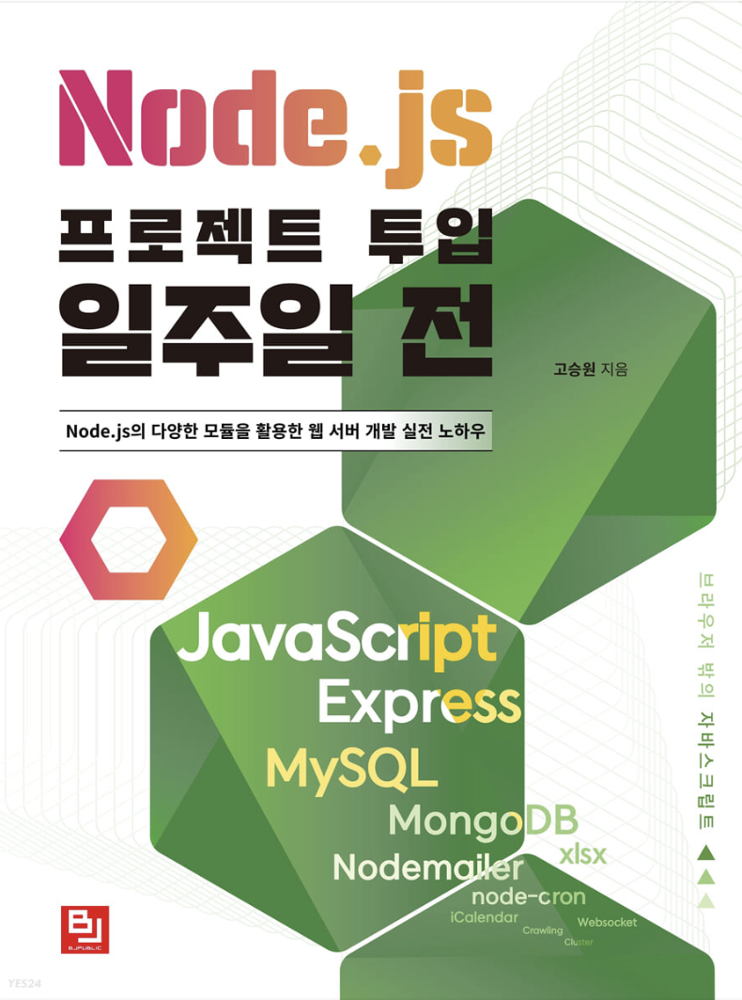

# Node.js 프로젝트 투입 일주일 전

***

    language:
	
	
    
     
    datbase:
    
    

***

## 목차

1. [Chapter 1 : Node.js](./gitreadme/ch1.md)
2. [Chapter 2 : 개발환경 구성](./gitreadme/ch2.md)
3. [Chapter 3 : 서버 프로그램을 위한 자바스크립트](./gitreadme/ch3.md)
4. [Chapter 4 : Node.js 시작하기](./gitreadme/ch4.md)
5. [Chapter 5 : Node.js 내장 모듈과 객체](./gitreadme/ch5.md)
6. [Chapter 6 : json-server 이용하기](./gitreadme/ch6.md)
7. [Chapter 7 : Express로 웹 서버 구축하기](./gitreadme/ch7.md)
8. [Chapter 8 : 데이터베이스 사용하기](./gitreadme/ch8.md)
9. [Chapter 9 : 애플리케이션 운영과 고성능 웹을 위한 Node.js](./gitreadme/ch9.md)
10. [Chapter 10 : Node.js 미니 프로젝트](./gitreadme/ch10.md)

### 미들웨어
* [body-parser](./gitreadme/middleware/body-parser.md)
* [compression](./gitreadme/middleware/compression.md)
* [cookie-session, express-session](./gitreadme/middleware/cookie-session_express-session.md)
* [cors](./gitreadme/middleware/cors.md)
* [multer](./gitreadme/middleware/multer.md)
* [response-time](./gitreadme/middleware/response-time.md)
* [connect-timeout](./gitreadme/middleware/connect-timeout.md)
